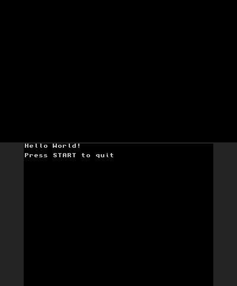
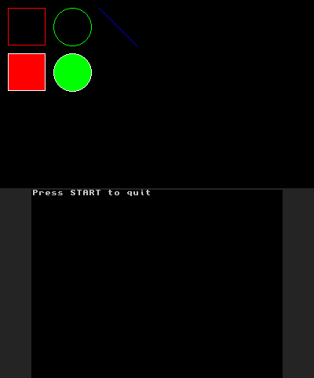
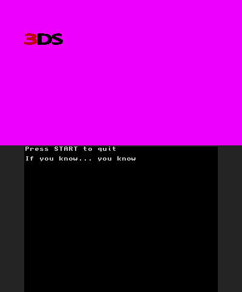
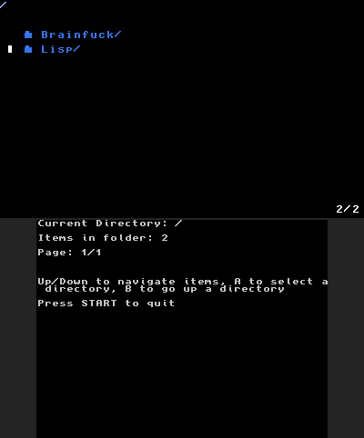
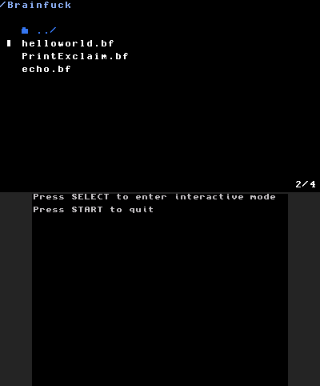
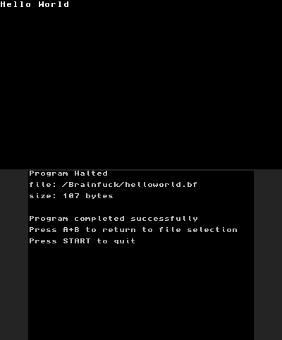
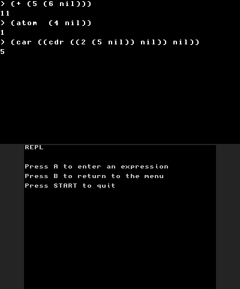

<div class="center" style="text-align:center;">
    
</div>

# 3DS Homebrew Projects
My home for 3ds homebrew projects in one place. Uses podman+podman-compose to orchestrate building of multiple projects where it is easy to add or remove projects as need be.

To compile projects see [compose.yml](#composeyml).

To test projects, any 3DS emulator can run homebrew apps, but I've been using Azahar for my own testing. 

To run projects on real hardware you must first have a 3DS console capable of running homebrew apps. Afterwards simply download the .3dsx files from the releases section, put them on your SD card under the 3ds folder and launch them from the homebrew app. 

- [3DS Homebrew Projects](#3ds-homebrew-projects)
  - [Files \& Directories](#files--directories)
    - [LIB/](#lib)
    - [ENVIRONMENT/](#environment)
    - [PROJECTS/](#projects)
    - [BIN/](#bin)
    - [compose.yml](#composeyml)
  - [Projects](#projects-1)
    - [Hello World (id: hello-world)](#hello-world-id-hello-world)
    - [Basic Shapes (id: basic-shapes)](#basic-shapes-id-basic-shapes)
    - [DVD Bounce (id: dvd-bounce)](#dvd-bounce-id-dvd-bounce)
    - [Explorer (id: explorer)](#explorer-id-explorer)
    - [BrainF\*\*k Runtime (id: runtime-bf)](#brainfk-runtime-id-runtime-bf)
    - [Tiny LISP Runtime (id: runtime-lisp)](#tiny-lisp-runtime-id-runtime-lisp)


## Files & Directories
### LIB/
The lib directory contains c++ files that are shared between all projects. In particular it contains `ez3ds.hpp` which is my 3ds abstraction layer which provides a small number of convenient classes and functions for quickly prototyping 3ds apps.

### ENVIRONMENT/
A minimal setup for a container image which is capable of compiling 3ds homebrew apps. This image is built with all required dependencies and then run against each sub-project to build project executables.

### PROJECTS/
The projects directory contains several sub-projects each of which generates their own 3ds homebrew app. 

### BIN/
The bin directory is where compiled homebrew executables (*.3dsx) will be generated for all projects.

### compose.yml
The compose.yml file lists all the sub-projects in the projects directory and provides a mapping between the build image and the project source files.

To build all projects just use:
```sh
podman compose -f compose.yml run --build --rm all
```

To build a specific project just replace `all` with the name of the project to build. For instance, to build the dvd-bounce project type:
```sh
podman compose -f compose.yml run --build --rm dvd-bounce
```

## Projects
### Hello World (id: hello-world)
This simple project does one thing and one thing only. It prints the text Hello World to the bottom screen of the console. Was a test in seeing if I could even compile a 3ds app.

<div align="center">

</div>

### Basic Shapes (id: basic-shapes)
This project was a test to see if I could write code to abstract away drawing to the framebuffer. In this project you will see squares, circles, lines etc drawn to the top screen of the 3ds. It does nothing else.

<div align="center">

</div>

### DVD Bounce (id: dvd-bounce)
This projects attempts to be a tongue and cheek recreation of the old school DVD logo idle screen, but for the 3ds. In this app, the 3ds logo will move around the top screen, bouncing when it hits the edges all while the background slowly changes colour to make it a little more interesting to watch. This was mainly an experiment in simple animation loops. 

<div align="center">

</div>

### Explorer (id: explorer)
This project creates a file-browser (otherwise called an explorer) for the SD card of the 3ds. You can use A to enter a directory or B to leave the directory. Folders with a lot of files will be split into pages in order to fit onto the screen. This project was to test my implementation of an abstraction over the 3ds button inputs. 

<div align="center">

</div>

### BrainF**k Runtime (id: runtime-bf)
This project implements an interpreter for the [BrainF**K](https://en.wikipedia.org/wiki/Brainfuck) programming language. Why... I still don't know. But if you ever want to run BF code on your 3ds system, now you can. It uses the same file-browser as the [Explorer](#explorer-id-explorer) project to allow you to select a *.bf file to execute. 

You can also enter a REPL mode using the SELECT button. After which you can enter BF instructions using the 3ds virtual keyboard and execute them immediately. 

The data tape is capped at 30,000 entries. 

The following symbols are valid BF operations, all other symbols are ignored:
```bf
> ; Increment the data pointer by 1
< ; Decrement the data pointer by 1
+ ; Increment the byte at the data pointer by 1
- ; Decrement the byte at the data pointer by 1
. ; Output the byte at the data pointer (in ascii)
, ; Prompt the user for a byte value (0-255) and store that at the data pointer
[ ; If the If the byte at the data pointer is zero, jump forward to the command after the matching ]
] ; If the byte at the data pointer is nonzero, jump backward to the command after the matching [
```

<div align="center">


</div>

### Tiny LISP Runtime (id: runtime-lisp)
This project implements an interpreter for a minimal dialect of [LISP](https://en.wikipedia.org/wiki/Lisp_(programming_language)). List like above, IDK Why. It uses the same file-browser as the [Explorer](#explorer-id-explorer) project to allow you to select a *.lisp file to execute. 

You can also enter a REPL mode by selecting the option from the main menu. After which you can use the 3ds virtual keyboard to type LISP expressions and have them immediately executed with the results shown on the screen. 

The following symbols represent built-in functions which should be complete enough to write any valid LISP program (assuming enough heap space):
```lisp
(define x y)        ; Bind value 'y' to the symbol 'x' globally
(lambda (x) (y))    ; Define a function whose arguments include 'x' and whose body is 'y'
(car x)             ; Get the first element in the list 'x'
(cdr x)             ; Get the rest of the elements in the list 'x' except the first 
(cons x y)          ; Construct a list with 'x' being the head and 'y' being the tail
(atom? x)           ; Test if 'x' is an atom, '1' if it is, '0' otherwise
(list? x)           ; Test if 'x' is a list, '1' if it is, '0' otherwise
(quote x)           ; Return 'x' without evaluating it
(cond (a? a) ...)   ; Test each condition 'a?'. If it evaluates to true, return 'a' otherwise try the next condition/body pair

(+ x y ...)         ; Add x and y if both are numbers
(- x y ...)         ; Subtract x and y if both are numbers
(* x y ...)         ; Multiply x and y if both are numbers
(/ x y ...)         ; Divide x and y if both are numbers
(> x y)             ; Compare x and y returning 1 if x > y or 0 otherwise
(< x y)             ; Compare x and y returning 1 if x < y or 0 otherwise
(= x y ...)         ; Compare x and y and if they are equal return 1 otherwise 0
```

<div align="center">

</div>